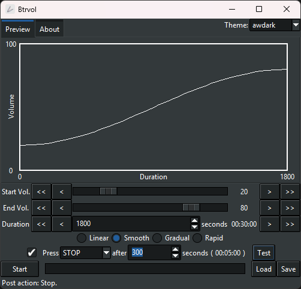

#  Btrvol

Adjust the volume gently.

> Readme: [English](./README.md), [正體中文](./README.zh.md)

Gently adjust the volume over time.

For example, slowly lower the volume when you fall asleep.

Present by: [undecV](https://github.com/undecv)

## :eyes: Glance



## :magic_wand: Features

- :snake: Built with **Python** and **Tkinter**.
- :level_slider: Four tone modes: **Linear**, **Smooth**, **Gradual**, and **Rapid**.
- :floppy_disk: Save and load your settings.
- :computer: Includes a **CLI program**.
- :bar_chart: Custom-built interactive chart for minimal footprint.
- :new: Light and dark **themes**.
- :new: Post-action supports **Play / Pause** or **Stop** media.

## :package: Installation

Download the **portable executable** file from the [Release page](../../releases).

> No installation required — just download and run.

## :question: How to use

- Start: Initial volume.
- End: Target volume.
- Duration: The length it takes to change the volume.

Functions decide how the volume change with time.

- Linear: Uniform change
- Smooth: Slow → Fast → Slow
- Gradual: Slow → Fast
- Rapid: Fast → Slow

Configuration files are stored in

```plain
%appdata%\Local\BtrVol\BtrVol\config.json
```

## Notes

- The startup is slow due to the security protection mechanism of the operating system.
