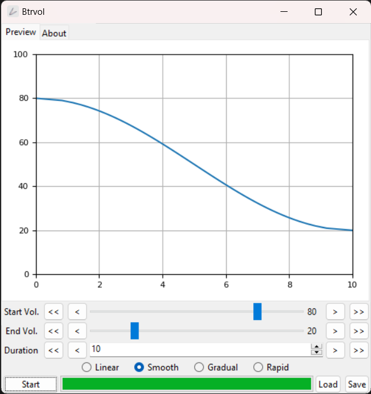

#  BtrVol

Adjust the volume gently.

> Readme: [English](./README.md), [正體中文](./README.zh.md)

Gently adjust the volume over time.

For example, slowly lower the volume when you fall asleep.

Present by: [undecV](https://github.com/undecv)

## Install

Download the portable executable file from the release page.

## Glance

## Features

- Built with Python and Tkinter. (Because the Winform used by v1 is extremely slow to start on Windows 11, so slow that one cannot help but think about the ultimate answer to life, the universe, and everything);
- Four tones: linear, smooth, Gradual, and Rapid;
- Adaptive interval mode, no longer need to specify intervals;
- Save and load settings.
- CLI program.

## How to use

- Start: Initial volume.
- End: Target volume.
- Duration: The length it takes to change the volume.

Functions decide how the volume change with time.

- Linear: uniformly.
- Smooth: slow, then fast, then slow.
- Gradual: slow, then fast.
- Rapid: fast, then slow.
