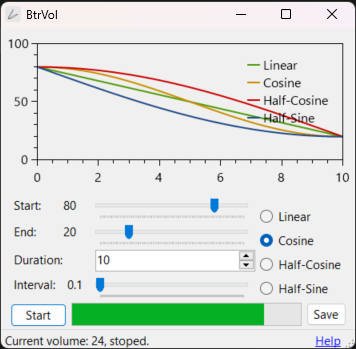

#  BtrVol

Adjust the volume gently.

> Readme: [English](./readme.md), [正體中文](./readme.zh.md)

Gently adjust the volume over time.

For example, slowly lower the volume when you fall asleep.

Present by: [undecV](https://github.com/undecv)

## Install

Download the portable executable file from the release page.

## Glance

## How to use

- Start: Initial volume.
- End: Target volume.
- Duration: The length it takes to change the volume.

Functions decide how the volume change with time.

- Linear: uniformly.
- Smooth: slow, then fast, then slow.
- Gradual: slow, then fast.
- Rapid: fast, then slow.
