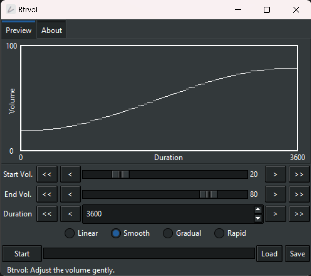

#  Btrvol

溫柔地調節音量。

> Readme: [English](./readme.md), [正體中文](./readme.zh.md)

隨著時間的推移輕輕調整音量。

例如，在您入睡的時候緩緩降低音量。

Present by: [undecV](https://github.com/undecv)

## 安裝

從 Release page 下載便攜執行檔。

## 壹覽無遺

## 特徵

- 通過 Python 和 Tkinter 建立。（因為 v1 使用的 Winform 在 Windows 11 上啟動速度極慢，慢到讓人不禁思考生命、宇宙及萬事萬物的終極答案）。
- 四種音調：線性、順滑、輕緩、急遽。
- 自適應間隔模式，再也不再需要指定間隔。
- 儲存、讀取設定。
- CLI 程式。
- 我們自己繪製了互動式圖表。

## 如何使用

- Start: 初始音量。
- End: 目標音量。
- Duration: 改變音量需要的時間的長度。

函數決定音量如何隨時間變化。

- Linear: 線性，均勻地。
- Smooth: 順滑，先緩後急再緩。
- Gradual: 輕緩，先緩後急。
- Rapid: 急遽，先急後緩。
