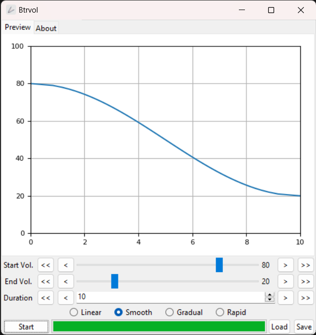

#  BtrVol

溫柔地調節音量。

> Readme: [English](./readme.md), [正體中文](./readme.zh.md)

用幾個妙不可言的數學公式調整音量。

例如，在您入睡的時候緩緩降低音量。

Present by: [undecV](https://github.com/undecv)

## 安裝

從 Release page 下載便攜執行檔。

## 壹覽無遺

## 如何使用

- Start: 初始音量。
- End: 目標音量。
- Duration: 改變音量需要的時間的長度。

函數決定音量如何隨時間變化。

- Linear: 線性，均勻地。
- Smooth: 先緩後急再緩。
- Gradual: 先緩後急。
- Rapid: 先急後緩。
