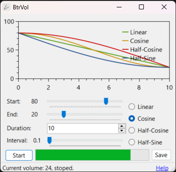

#  BtrVol

溫柔地調節音量。

> Readme: [English](./readme.md), [正體中文](./readme.zh.md)

「體驗無與倫比的聲音調控，我們的軟體利用精細的弦波函數來自由控制音量，無論您在工作、休閒，或是準備入睡，都可以根據您的需要，自然且流暢地調整音量，為您提供最舒適的聆聽體驗。」—— ChatGPT

Present by: [undecV](https://github.com/undecv)

## 安裝

系統需求：`Windows`, `.NET 6.0`.

從 Release page 下載便攜執行檔。

## 壹覽無遺

## 如何使用

- Start: 初始音量。
- End: 目標音量。
- Duration: 改變音量需要的時間的長度。
- Interval: 每時間間隔改變音量。小的間隔使得音量的變化更加的柔和，反之亦然。

函數決定音量如何隨時間變化。

- Linear: 線性，均勻地。
- Cosine: 餘弦，先緩後急再緩。
- Half-cosine: 先緩後急。
- Half-sine: 先急後緩。

## Package Reference

- [AudioSwitcher](https://github.com/xenolightning/AudioSwitcher) (MS-PL)
- [OxyPlot](https://github.com/oxyplot/oxyplot) (MIT)
- [Windows API Code Pack](https://www.nuget.org/packages/Microsoft.WindowsAPICodePack-Shell)
